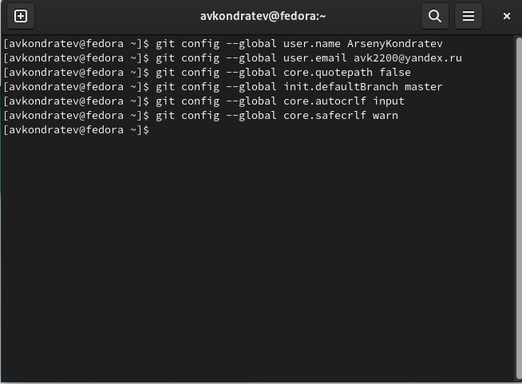
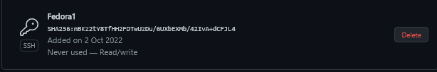
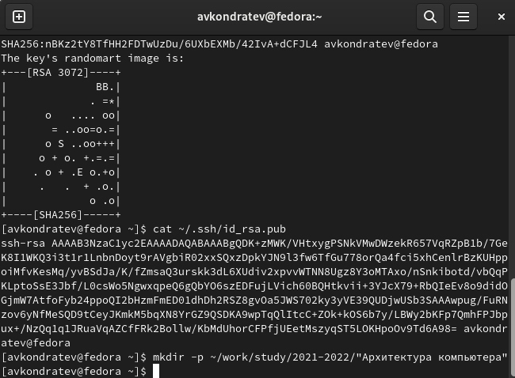
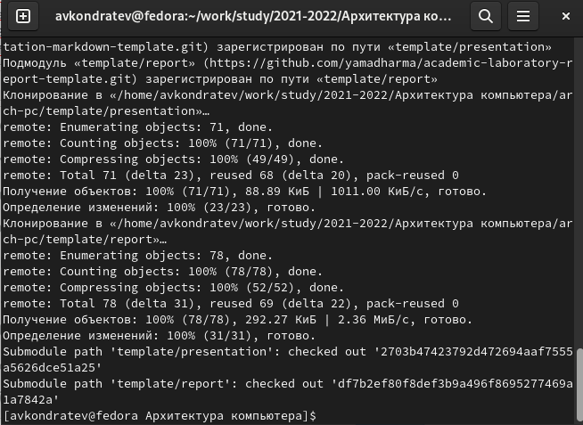
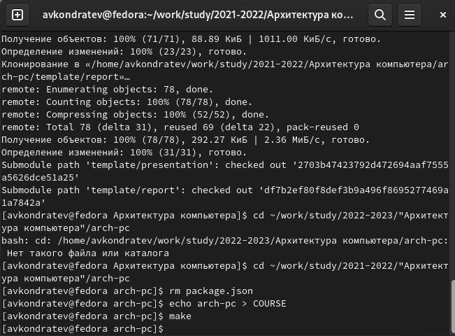
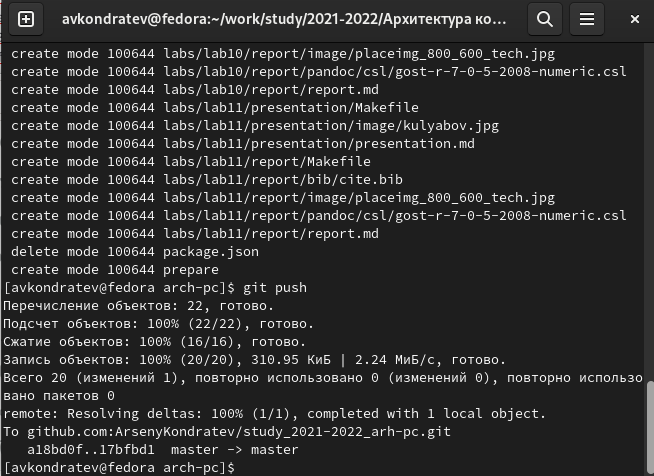

---
## Front matter
lang: ru-RU
title: "Лабораторная работа №4"
subtitle: "Дисциплина: Архитектура компьютера"
author: "Кондратьев Арсений Вячеславович"
institute: "Российский университет дружбы народов, Москва, Россия"
date: 02.10.2022

## Generic otions
lang: ru-RU
toc-title: "Содержание"

## Bibliography
bibliography: bib/cite.bib
csl: pandoc/csl/gost-r-7-0-5-2008-numeric.csl

## Pdf output format
toc: true # Table of contents
toc-depth: 2

fontsize: 12pt
linestretch: 1.5
papersize: a4
documentclass: scrreprt
## I18n polyglossia
polyglossia-lang:
  name: russian
  options:
	- spelling=modern
	- babelshorthands=true
polyglossia-otherlangs:
  name: english
## I18n babel
babel-lang: russian
babel-otherlangs: english
## Fonts
mainfont: PT Serif
romanfont: PT Serif
sansfont: PT Sans
monofont: PT Mono
mainfontoptions: Ligatures=TeX
romanfontoptions: Ligatures=TeX
sansfontoptions: Ligatures=TeX,Scale=MatchLowercase
monofontoptions: Scale=MatchLowercase,Scale=0.9
## Biblatex
biblatex: true
biblio-style: "gost-numeric"
biblatexoptions:
  - parentracker=true
  - backend=biber
  - hyperref=auto
  - language=auto
  - autolang=other*
  - citestyle=gost-numeric

## Misc options
indent: true
header-includes:
  - \usepackage{indentfirst}
  - \usepackage{float} # keep figures where there are in the text
  - \floatplacement{figure}{H} # keep figures where there are in the text
---

# Цель работы

Составить отчет по 3 лабораторной в формате Markdown

# Выполнение лабораторной работы

1. Сделать  предварительную конфигурацию git(рис.[-@fig:001])

 { #fig:001 width=70% }
 
2. Создание SSH ключа(рис.[-@fig:002])

{ #fig:002 width=70% }

3.	Создать каталог для предмета(рис.[-@fig:003])

{ #fig:003 width=70% }

4.	Клонировать созданный репозиторий(рис.[-@fig:004])

{ #fig:004 width=70% }

5.	Удалил лишние файлы и создал необходимые каталоги(рис.[-@fig:005])

{ #fig:005 width=70% }

6.	Отправил файлы на сервер(рис.[-@fig:006])

{ #fig:006 width=70% }

# Выводы

Я составил отчет по 3 лабораторной в формате Markdown

# Контрольные вопросы

1.	Markdown - это облегчённый язык разметки, созданный с целью обозначения форматирования в простом тексте, с максимальным сохранением его читаемости человеком, и пригодный для машинного преобразования в языки для продвинутых публикаций

2. Чтобы задать для текста полужирное начертание, заключите его в двойные
звездочки. Чтобы задать для текста курсивное начертание, заключите его в одинарные
звездочки

3. С помощью цифр, звездочек или тире

4. в квадратных скобках указывается подпись к изображению; в круглых скобках указывается URL-адрес или относительный путь изображения, а также (необязательно) всплывающую подсказку, заключённую
в двойные или одиночные кавычки. в фигурных скобках указывается идентификатор изображения (#fig:fig1) для ссылки на него по тексту и размер изображения относительно ширины страницы (width=90%)

5. аналогично формулам LaTeX

