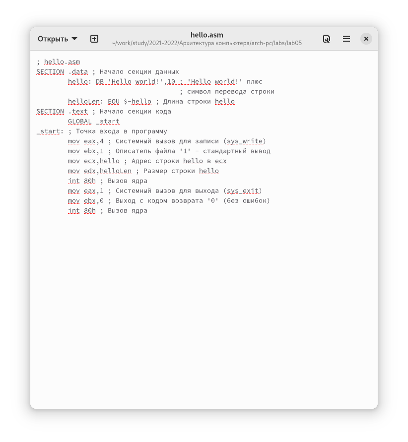
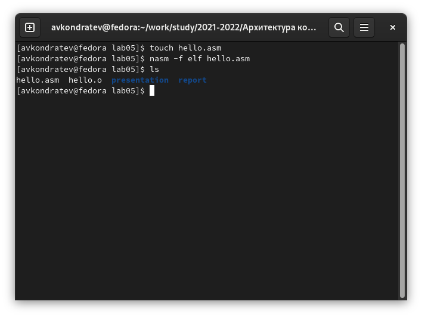
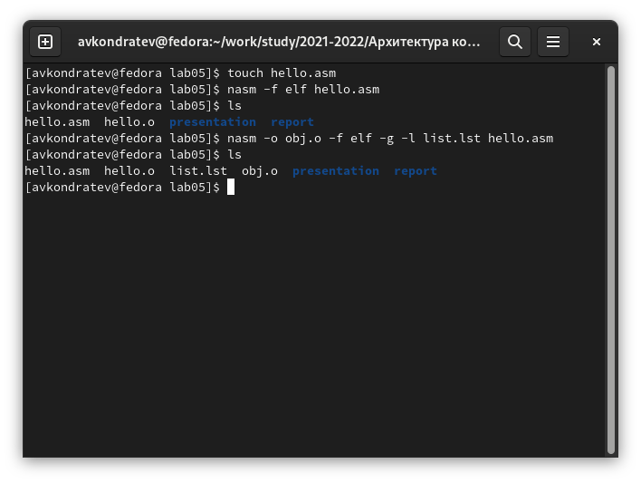
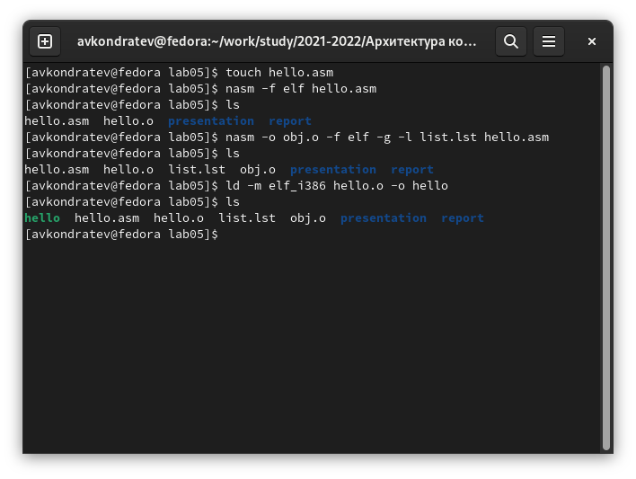
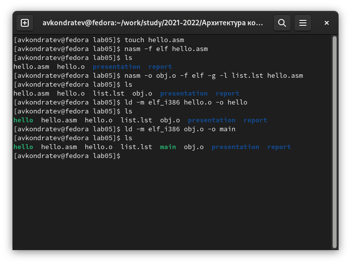
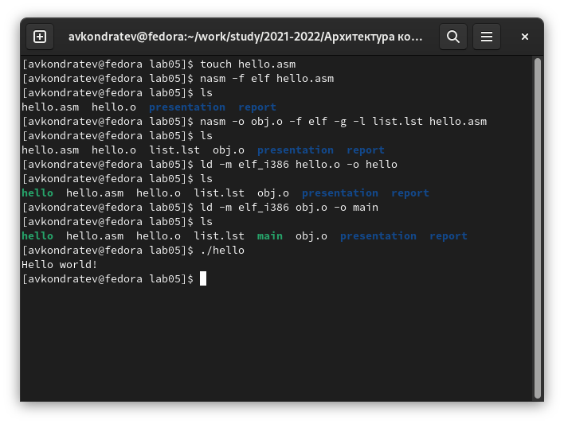
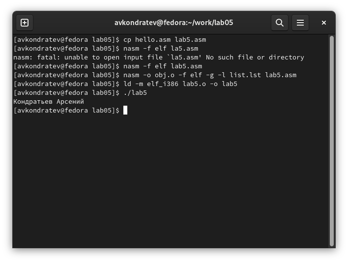

---
## Front matter
lang: ru-RU
title: "Лабораторная работа №5"
subtitle: "Дисциплина: Архитектура компьютера"
author: "Кондратьев Арсений Вячеславович"
institute: "Российский университет дружбы народов, Москва, Россия"
date: 03.10.2022

## Generic otions
lang: ru-RU
toc-title: "Содержание"

## Bibliography
bibliography: bib/cite.bib
csl: pandoc/csl/gost-r-7-0-5-2008-numeric.csl

## Pdf output format
toc: true # Table of contents
toc-depth: 2

fontsize: 12pt
linestretch: 1.5
papersize: a4
documentclass: scrreprt
## I18n polyglossia
polyglossia-lang:
  name: russian
  options:
	- spelling=modern
	- babelshorthands=true
polyglossia-otherlangs:
  name: english
## I18n babel
babel-lang: russian
babel-otherlangs: english
## Fonts
mainfont: PT Serif
romanfont: PT Serif
sansfont: PT Sans
monofont: PT Mono
mainfontoptions: Ligatures=TeX
romanfontoptions: Ligatures=TeX
sansfontoptions: Ligatures=TeX,Scale=MatchLowercase
monofontoptions: Scale=MatchLowercase,Scale=0.9
## Biblatex
biblatex: true
biblio-style: "gost-numeric"
biblatexoptions:
  - parentracker=true
  - backend=biber
  - hyperref=auto
  - language=auto
  - autolang=other*
  - citestyle=gost-numeric

## Misc options
indent: true
header-includes:
  - \usepackage{indentfirst}
  - \usepackage{float} # keep figures where there are in the text
  - \floatplacement{figure}{H} # keep figures where there are in the text
---

# Цель работы

Освоение процедуры компиляции и сборки программ, написанных на ассемблере NASM

# Выполнение лабораторной работы

1. Создал текстовый файл с именем hello.asm и ввел в него данный текст(рис.[-@fig:001])

 { #fig:001 width=70% }
 
2. Скомпилировал приведённый выше текст программы «Hello World»(рис.[-@fig:002])

{ #fig:002 width=70% }

3.	Скомпилировал исходный файл hello.asm в obj.o и создал файл листинга list.lst(рис.[-@fig:003])

{ #fig:003 width=70% }

4.	Получил исполняемую программу(рис.[-@fig:004])

{ #fig:004 width=70% }

5.	Получил исполняемую программу, указав имя main.(рис.[-@fig:005])

{ #fig:005 width=70% }

6.	Запустил на выполнение созданный исполняемый файл(рис.[-@fig:006])

{ #fig:006 width=70% }

7.	Создал копию с именем lab5 и изменил код, чтобы выводились мое имя и фамилия(рис.[-@fig:007])

{ #fig:007 width=70% }

# Выводы

Я освоил процедуры компиляции и сборки программ, написанных на ассемблере NASM

# Контрольные вопросы

1.	ассемблерная программа содержит только тот код, который ввёл программист. Таким образом язык ассемблера — это язык, с помощью которого понятным для человека
образом пишутся команды для процессора

2. директивы не переводящиеся непосредственно в машинные команды, а управляющие работой транслятора

3. Набор текста программы в текстовом редакторе и сохранение её в отдельном файле. Каждый файл имеет свой тип (или расширение), который
определяет назначение файла. Файлы с исходным текстом программ на
языке ассемблера имеют тип asm.

    Трансляция — преобразование с помощью транслятора, например nasm,
текста программы в машинный код, называемый объектным. На данном
этапе также может быть получен листинг программы, содержащий кроме
текста программы различную дополнительную информацию, созданную
транслятором. Тип объектного файла — o, файла листинга — lst.

    Компоновка или линковка — этап обработки объектного кода компоновщиком (ld), который принимает на вход объектные файлы и собирает по
ним исполняемый файл. Исполняемый файл обычно не имеет расширения. Кроме того, можно получить файл карты загрузки программы в ОЗУ,
имеющий расширение map.

    Запуск программы. Конечной целью является работоспособный исполняемый файл. Ошибки на предыдущих этапах могут привести к некорректной работе программы, поэтому может присутствовать этап отладки
программы при помощи специальной программы — отладчика. При нахождении ошибки необходимо провести коррекцию программы, начиная
с первого шага

4. набор текста программы, трансляция, компановка

5. преобразование с помощью транслятора, например nasm,
текста программы в машинный код, называемый объектным. На данном
этапе также может быть получен листинг программы, содержащий кроме
текста программы различную дополнительную информацию, созданную
транслятором

6. этап обработки объектного кода компоновщиком (ld), который принимает на вход объектные файлы и собирает по ним исполняемый файл

7. NASM не запускают без параметров. Ключ -f указывает транслятору, что требуется создать бинарные файлы в формате ELF. Следует отметить, что формат
elf64 позволяет создавать исполняемый код, работающий под 64-битными версиями Linux. Для 32-битных версий ОС указываем в качестве формата просто elf

8. nasm - .o; ld - исполняемая программа

