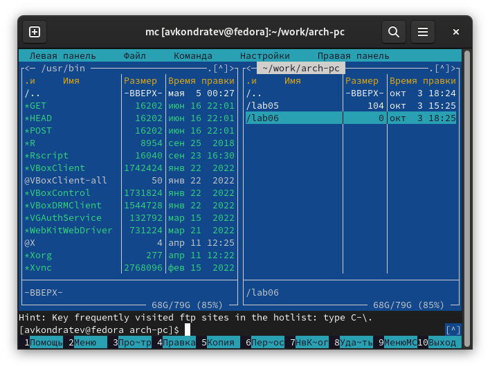

---
## Front matter
lang: ru-RU
title: "Лабораторная работа №6"
subtitle: "Дисциплина: Архитектура компьютера"
author: "Кондратьев Арсений Вячеславович"
institute: "Российский университет дружбы народов, Москва, Россия"
date: 04.10.2022

## Generic otions
lang: ru-RU
toc-title: "Содержание"

## Bibliography
bibliography: bib/cite.bib
csl: pandoc/csl/gost-r-7-0-5-2008-numeric.csl

## Pdf output format
toc: true # Table of contents
toc-depth: 2

fontsize: 12pt
linestretch: 1.5
papersize: a4
documentclass: scrreprt
## I18n polyglossia
polyglossia-lang:
  name: russian
  options:
	- spelling=modern
	- babelshorthands=true
polyglossia-otherlangs:
  name: english
## I18n babel
babel-lang: russian
babel-otherlangs: english
## Fonts
mainfont: PT Serif
romanfont: PT Serif
sansfont: PT Sans
monofont: PT Mono
mainfontoptions: Ligatures=TeX
romanfontoptions: Ligatures=TeX
sansfontoptions: Ligatures=TeX,Scale=MatchLowercase
monofontoptions: Scale=MatchLowercase,Scale=0.9
## Biblatex
biblatex: true
biblio-style: "gost-numeric"
biblatexoptions:
  - parentracker=true
  - backend=biber
  - hyperref=auto
  - language=auto
  - autolang=other*
  - citestyle=gost-numeric

## Misc options
indent: true
header-includes:
  - \usepackage{indentfirst}
  - \usepackage{float} # keep figures where there are in the text
  - \floatplacement{figure}{H} # keep figures where there are in the text
---

# Цель работы

Приобретение практических навыков работы в Midnight Commander. Освоение
инструкций языка ассемблера mov и int

# Выполнение лабораторной работы

1. С помощью функциональной клавиши F7 создайте папку lab06 и перейдите в созданный каталог(рис.[-@fig:001])

 { #fig:001 width=70% }
 
2. Пользуясь строкой ввода и командой touch создайте файл lab6-1.asm(рис.[-@fig:002])

{ #fig:002 width=70% }

3.	С помощью функциональной клавиши F4 откройте файл lab6-1.asm для редактирования во встроенном редакторе(рис.[-@fig:003])

{ #fig:003 width=70% }

4.	Оттранслируйте текст программы lab6-1.asm в объектный файл. Выполните компоновку объектного файла и запустите получившийся исполняемый файл(рис.[-@fig:004])

{ #fig:004 width=70% }

5.	Переместил in_out.asm в каталог с исполнительными файлами(рис.[-@fig:005])

{ #fig:005 width=70% }

6.	С помощью функциональной клавиши F6 создайте копию файла lab6-1.asm с именем lab6-2.asm(рис.[-@fig:006])

{ #fig:006 width=70% }

7.	Исправьте текст программы в файле lab6-2.asm с использование подпрограмм из внешнего файла in_out.asm(рис.[-@fig:007])

{ #fig:007 width=70% }

8.	В файле lab6-2.asm замените подпрограмму sprintLF на sprint. Создайте исполняемый файл и проверьте его работу(рис.[-@fig:008])

{ #fig:008 width=70% }

Разница в том, что sprintLF переносит строку, а sprint нет.

9.	Создайте копию файла lab6-1.asm. Внесите изменения в программу (без
использования внешнего файла in_out.asm), так чтобы она выводила введенный текст(рис.[-@fig:009])(рис.[-@fig:010])

{ #fig:009 width=70% }

{ #fig:010 width=70% }

10.	Создайте копию файла lab6-2.asm. Исправьте текст программы с использование подпрограмм из внешнего файла in_out.asm, так чтобы она выводила введенный текст(рис.[-@fig:009])(рис.[-@fig:010])

{ #fig:011 width=70% }

{ #fig:012 width=70% }

# Выводы

Я приобрел практические навыки работы в Midnight Commander. Освоил
инструкции языка ассемблера mov и int.

# Контрольные вопросы

1.	это программа, которая позволяет
просматривать структуру каталогов и выполнять основные операции по управлению файловой системой, т.е. mc является файловым менеджером. Midnight
Commander позволяет сделать работу с файлами более удобной и наглядной

2. Копирование(cp; F5)  
перенос(mv; F6)  
просмотр(cat; F3)  
создание каталога(mkdir; F7)  
удаление(rm; F8)  

3. состоит из трёх секций:
секция кода программы (SECTION .text), секция инициированных (известных
во время компиляции) данных (SECTION .data) и секция неинициализированных данных (тех, под которые во время компиляции только отводится память,
а значение присваивается в ходе выполнения программы) (SECTION .bss)

4. неинициализированных и инициированных

5. DB (define byte) — определяет переменную размером в 1 байт;   
DW (define word) — определяет переменную размеров в 2 байта (слово);   
DD (define double word) — определяет переменную размером в 4 байта
(двойное слово);   
DQ (define quad word) — определяет переменную размером в 8 байт (учетверённое слово);   
DT (define ten bytes) — определяет переменную размером в 10 байт.  

6. произойдет дублирование данных esi в eax

7. Вызов ядра

