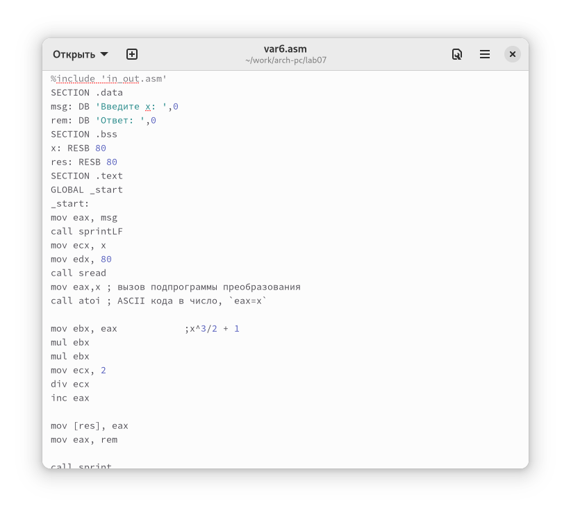

---
## Front matter
lang: ru-RU
title: "Лабораторная работа №7"
subtitle: "Дисциплина: Архитектура компьютера"
author: "Кондратьев Арсений Вячеславович"
institute: "Российский университет дружбы народов, Москва, Россия"
date: 04.10.2022

## Generic otions
lang: ru-RU
toc-title: "Содержание"

## Bibliography
bibliography: bib/cite.bib
csl: pandoc/csl/gost-r-7-0-5-2008-numeric.csl

## Pdf output format
toc: true # Table of contents
toc-depth: 2

fontsize: 12pt
linestretch: 1.5
papersize: a4
documentclass: scrreprt
## I18n polyglossia
polyglossia-lang:
  name: russian
  options:
	- spelling=modern
	- babelshorthands=true
polyglossia-otherlangs:
  name: english
## I18n babel
babel-lang: russian
babel-otherlangs: english
## Fonts
mainfont: PT Serif
romanfont: PT Serif
sansfont: PT Sans
monofont: PT Mono
mainfontoptions: Ligatures=TeX
romanfontoptions: Ligatures=TeX
sansfontoptions: Ligatures=TeX,Scale=MatchLowercase
monofontoptions: Scale=MatchLowercase,Scale=0.9
## Biblatex
biblatex: true
biblio-style: "gost-numeric"
biblatexoptions:
  - parentracker=true
  - backend=biber
  - hyperref=auto
  - language=auto
  - autolang=other*
  - citestyle=gost-numeric

## Misc options
indent: true
header-includes:
  - \usepackage{indentfirst}
  - \usepackage{float} # keep figures where there are in the text
  - \floatplacement{figure}{H} # keep figures where there are in the text
---

# Цель работы

Освоение арифметических инструкций языка ассемблера NASM

# Выполнение лабораторной работы

1. Ввел листинг и получил на вывод j(рис.[-@fig:001])

 { #fig:001 width=70% }
 
2. Ввел листинг и получил на вывод перенос строки(рис.[-@fig:002])

{ #fig:002 width=70% }

3.	Ввел листинг и получил на вывод 106(рис.[-@fig:003])

{ #fig:003 width=70% }

4.	Ввел листинг и получил на вывод 10(рис.[-@fig:004])

{ #fig:004 width=70% }

5.	Заменил функцию iprintLF на iprint, после которой не было переноса строки(рис.[-@fig:005])

{ #fig:005 width=70% }

6.	Написал программу вычисления выражения (5 * 2 + 3)/3(рис.[-@fig:006])

{ #fig:006 width=70% }

7.	Написал программу вычисления варианта, получил вариант 6(рис.[-@fig:007])

{ #fig:007 width=70% }

8.	Написал программу вычисления функции 6-го варианта(рис.[-@fig:008])

{ #fig:008 width=70% }

8.1. (rem: DB 'Ваш вариант: ',0) (mov eax,rem) и (call sprint)  
8.2. перенос в регистр есх адреса переменной х; передача регистру значения 80; вызов функции считывания  
8.3. преобразование ASCII кода в число  
8.4. xor edx,edx   
mov ebx,20   
div ebx  
inc edx  
8.5. прибавляет 1 к edx  
8.6. mov eax,rem  
call sprint  
mov eax,edx  
call iprintLF  

9.	Проверил работу на числах 2 и 5(рис.[-@fig:009])

{ #fig:009 width=70% }

# Выводы

Я освоил арифметические инструкции языка ассемблера NASM

# Контрольные вопросы

1. add слагаемое1, слагаемое2

2. mul

3. div делитель

4. в АХ

5. add-сложение  
neg-смена знака  
mul-умножение  
div-деление  
inc- +1  
dec- -1  
sub-вычитание

6. АХ

7. AL, AH

