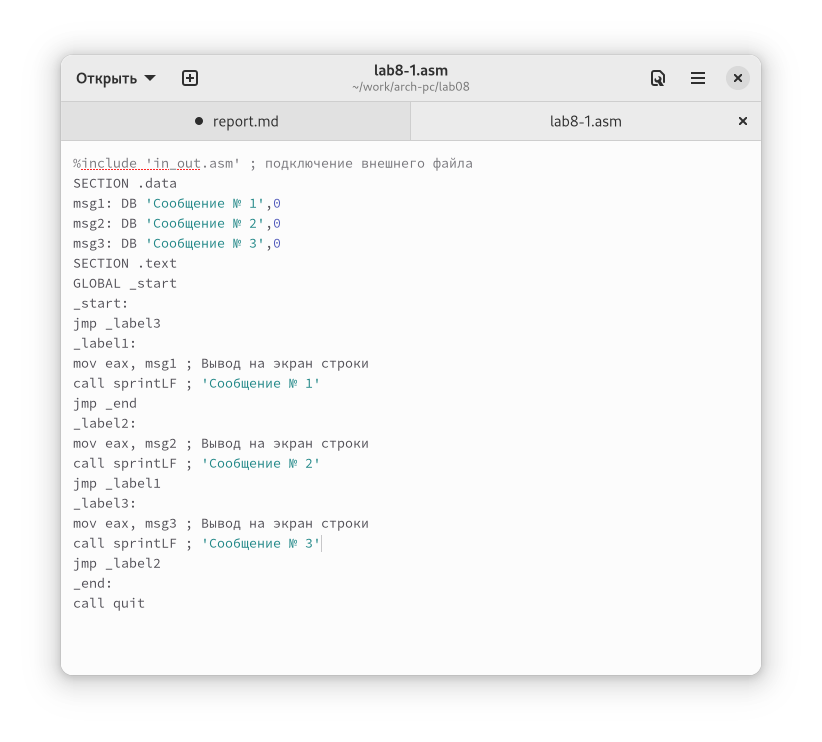

---
## Front matter
lang: ru-RU
title: "Лабораторная работа №8"
subtitle: "Дисциплина: Архитектура компьютера"
author: "Кондратьев Арсений Вячеславович"
institute: "Российский университет дружбы народов, Москва, Россия"
date: 04.10.2022

## Generic otions
lang: ru-RU
toc-title: "Содержание"

## Bibliography
bibliography: bib/cite.bib
csl: pandoc/csl/gost-r-7-0-5-2008-numeric.csl

## Pdf output format
toc: true # Table of contents
toc-depth: 2

fontsize: 12pt
linestretch: 1.5
papersize: a4
documentclass: scrreprt
## I18n polyglossia
polyglossia-lang:
  name: russian
  options:
	- spelling=modern
	- babelshorthands=true
polyglossia-otherlangs:
  name: english
## I18n babel
babel-lang: russian
babel-otherlangs: english
## Fonts
mainfont: PT Serif
romanfont: PT Serif
sansfont: PT Sans
monofont: PT Mono
mainfontoptions: Ligatures=TeX
romanfontoptions: Ligatures=TeX
sansfontoptions: Ligatures=TeX,Scale=MatchLowercase
monofontoptions: Scale=MatchLowercase,Scale=0.9
## Biblatex
biblatex: true
biblio-style: "gost-numeric"
biblatexoptions:
  - parentracker=true
  - backend=biber
  - hyperref=auto
  - language=auto
  - autolang=other*
  - citestyle=gost-numeric

## Misc options
indent: true
header-includes:
  - \usepackage{indentfirst}
  - \usepackage{float} # keep figures where there are in the text
  - \floatplacement{figure}{H} # keep figures where there are in the text
---

# Цель работы

Изучение команд условного и безусловного переходов. Приобретение навыков написания программ с использованием переходов. Знакомство с назначением и структурой файла листинга.

# Выполнение лабораторной работы

1. Проверил работу листинга с программой с использованием инструкции jmp(рис.[-@fig:001])

 { #fig:001 width=70% }
 
2. Изменил текст программы в соответствии с листингом 8.2(рис.[-@fig:002])

{ #fig:002 width=70% }

3.	Изменил текст программы добавив или изменив инструкции jmp, чтобы
вывод программы был следующим(рис.[-@fig:003])(рис.[-@fig:004])

{ #fig:003 width=70% }

{ #fig:004 width=70% }

4.	Открыл файл с программой lab8-2.asm и в любой инструкции с двумя
операндами удалил один операнд(рис.[-@fig:004])(рис.[-@fig:005])

Выдало ошибку  
{ #fig:005 width=70% }

В файле листинга появилась строка с ошибкой  
{ #fig:005 width=70% }

5.	Написал программу нахождения наименьшей из 3 целочисленных переменных и проверил ее работу на числах 79,83,41(рис.[-@fig:007])

{ #fig:007 width=70% }

6.	Напишите программу, которая для введенных с клавиатуры значений х и а вычисляет значение заданной функции(рис.[-@fig:008])

{ #fig:008 width=70% }

# Выводы

Я изучил команды условного и безусловного переходов. Приобрел навыки написания программ с использованием переходов. Познакомился с назначением и структурой файла листинга.

# Контрольные вопросы

1. это один из выходных файлов, создаваемых транслятором. Он имеет текстовый вид и нужен при отладке
программы, так как кроме строк самой программы он содержит дополнительную информацию.

2. lst, номер строки, адрес, машинный код, исходный текст программы

3. с помощью сравнения cmp и команд перехода jmp и j

4. условного j<мнемоника перехода> label  
безусловного jmp <адрес_перехода>

5. вычитает из одного операнда другой и в зависимости от значения передает флаг

6. j<мнемоника перехода> label

7. cmp eax, ebx  
je point ;если eax = ebx, то переходим в point

8. jmp label ;переход на метку label

