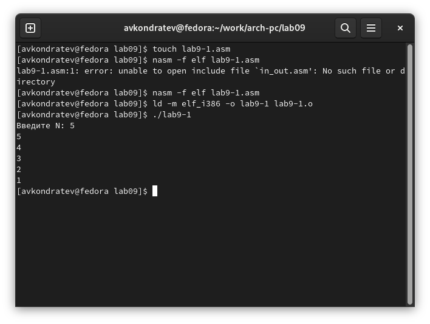
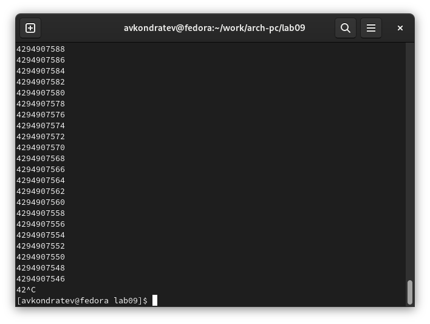
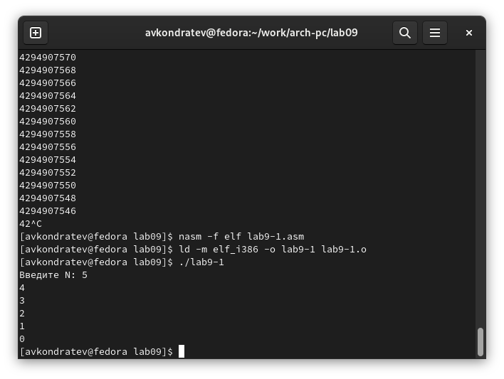
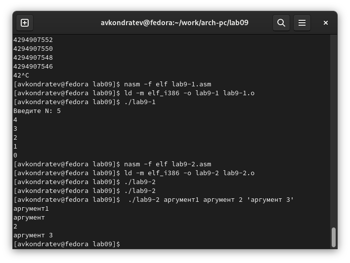
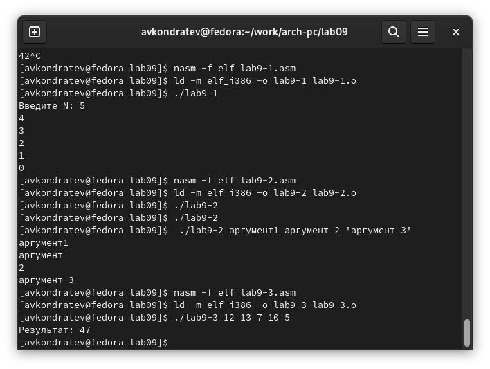
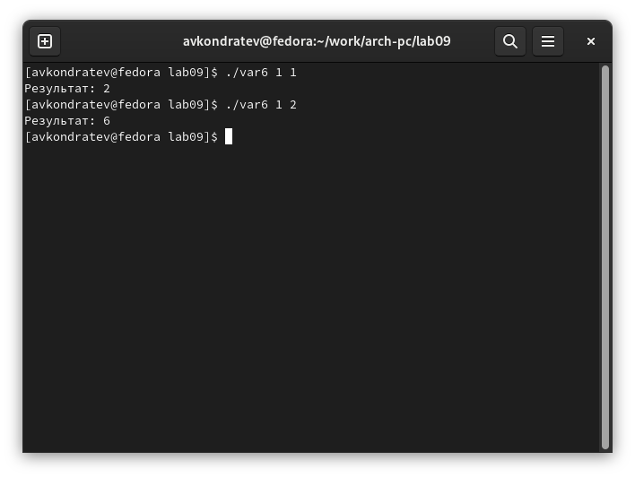

---
## Front matter
lang: ru-RU
title: "Лабораторная работа №9"
subtitle: "Дисциплина: Архитектура компьютера"
author: "Кондратьев Арсений Вячеславович"
institute: "Российский университет дружбы народов, Москва, Россия"
date: 06.10.2022

## Generic otions
lang: ru-RU
toc-title: "Содержание"

## Bibliography
bibliography: bib/cite.bib
csl: pandoc/csl/gost-r-7-0-5-2008-numeric.csl

## Pdf output format
toc: true # Table of contents
toc-depth: 2

fontsize: 12pt
linestretch: 1.5
papersize: a4
documentclass: scrreprt
## I18n polyglossia
polyglossia-lang:
  name: russian
  options:
	- spelling=modern
	- babelshorthands=true
polyglossia-otherlangs:
  name: english
## I18n babel
babel-lang: russian
babel-otherlangs: english
## Fonts
mainfont: PT Serif
romanfont: PT Serif
sansfont: PT Sans
monofont: PT Mono
mainfontoptions: Ligatures=TeX
romanfontoptions: Ligatures=TeX
sansfontoptions: Ligatures=TeX,Scale=MatchLowercase
monofontoptions: Scale=MatchLowercase,Scale=0.9
## Biblatex
biblatex: true
biblio-style: "gost-numeric"
biblatexoptions:
  - parentracker=true
  - backend=biber
  - hyperref=auto
  - language=auto
  - autolang=other*
  - citestyle=gost-numeric

## Misc options
indent: true
header-includes:
  - \usepackage{indentfirst}
  - \usepackage{float} # keep figures where there are in the text
  - \floatplacement{figure}{H} # keep figures where there are in the text
---

# Цель работы

Приобретение навыков написания программ с использованием циклов и
обработкой аргументов командной строки.

# Выполнение лабораторной работы

1. Выполнил программу вывода значений регистра ecx(рис.[-@fig:001])

 { #fig:001 width=70% }
 
2. Изменил текст программы, добавив изменение значение регистра ecx в цикле(рис.[-@fig:002])

{ #fig:002 width=70% }

3.	Внес изменения в текст программы, добавив команды push и pop (рис.[-@fig:003])

{ #fig:003 width=70% }

4.	Написал программу выводящую на экран аргументы командной строки(рис.[-@fig:004])

{ #fig:004 width=70% }

5.	Написал программу вычисления суммы аргументов командной строки(рис.[-@fig:005])

{ #fig:005 width=70% }

6.	Напишите программу, которая находит сумму значений функции в соответствии с 6 вариантом(рис.[-@fig:006])

{ #fig:006 width=70% }

# Выводы

Я приобрел навыки написания программ с использованием циклов и
обработкой аргументов командной строки.

# Контрольные вопросы

1. Иструкция loop выполняется в два этапа. Сначала из регистра ecx вычитается
единица и его значение сравнивается с нулём. Если регистр не равен нулю,
то выполняется переход к указанной метке. Иначе переход не выполняется и
управление передаётся команде, которая следует сразу после команды loop

2. С помощью условного оператора, который будет возвращать нас в начальную позицию цикла, пока не будет выполнено условие

3. Стек — это структура данных, организованная по принципу LIFO («Last In
— First Out» или «последним пришёл — первым ушёл»). Стек является частью
архитектуры процессора и реализован на аппаратном уровне

4. Стек имеет вершину, адрес последнего добавленного элемента, который хранится в регистре esp (указатель стека). Противоположный конец стека называется дном. Значение, помещённое в стек последним, извлекается первым

