---
## Front matter
lang: ru-RU
title: "Лабораторная работа №10"
subtitle: "Дисциплина: Архитектура компьютера"
author: "Кондратьев Арсений Вячеславович"
institute: "Российский университет дружбы народов, Москва, Россия"
date: 07.10.2022

## Generic otions
lang: ru-RU
toc-title: "Содержание"

## Bibliography
bibliography: bib/cite.bib
csl: pandoc/csl/gost-r-7-0-5-2008-numeric.csl

## Pdf output format
toc: true # Table of contents
toc-depth: 2

fontsize: 12pt
linestretch: 1.5
papersize: a4
documentclass: scrreprt
## I18n polyglossia
polyglossia-lang:
  name: russian
  options:
	- spelling=modern
	- babelshorthands=true
polyglossia-otherlangs:
  name: english
## I18n babel
babel-lang: russian
babel-otherlangs: english
## Fonts
mainfont: PT Serif
romanfont: PT Serif
sansfont: PT Sans
monofont: PT Mono
mainfontoptions: Ligatures=TeX
romanfontoptions: Ligatures=TeX
sansfontoptions: Ligatures=TeX,Scale=MatchLowercase
monofontoptions: Scale=MatchLowercase,Scale=0.9
## Biblatex
biblatex: true
biblio-style: "gost-numeric"
biblatexoptions:
  - parentracker=true
  - backend=biber
  - hyperref=auto
  - language=auto
  - autolang=other*
  - citestyle=gost-numeric

## Misc options
indent: true
header-includes:
  - \usepackage{indentfirst}
  - \usepackage{float} # keep figures where there are in the text
  - \floatplacement{figure}{H} # keep figures where there are in the text
---

# Цель работы

Приобретение навыков написания программ с использованием подпрограмм.
Знакомство с методами отладки при помощи GDB и его основными возможностями

# Выполнение лабораторной работы

1. Реализовал пример программы с использованием вызова подпрограммы(рис.[-@fig:001])

 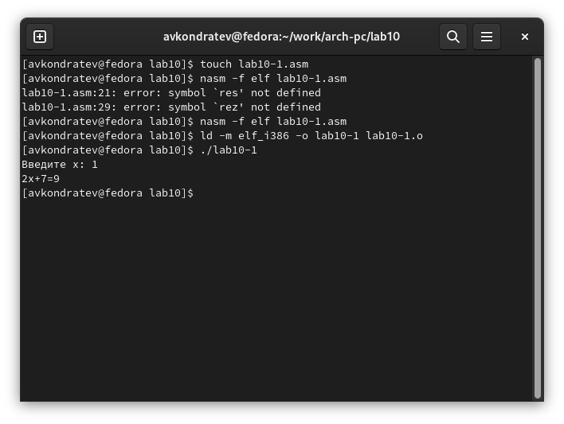{ #fig:001 width=70% }
 
2. Реализовал программу вывода сообщения Hello world! и проверил работу программы, запустив ее в оболочке GDB с помощью команды run
(рис.[-@fig:002])

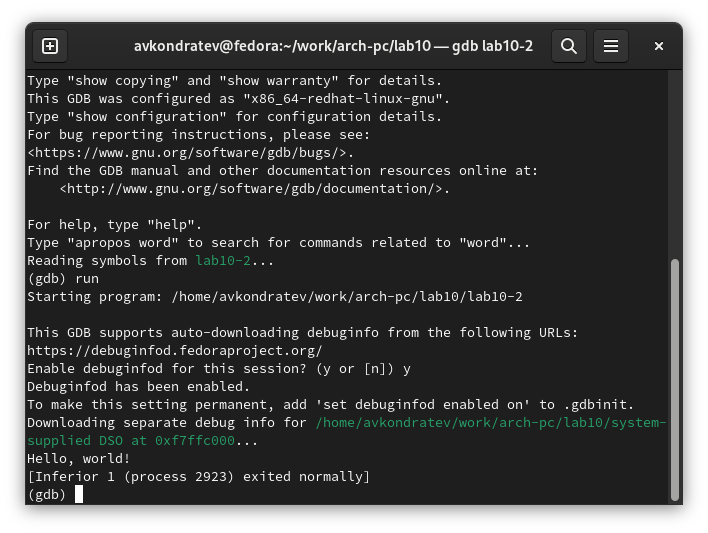{ #fig:002 width=70% }

3.	Установил брейкпоинт на метку _start (рис.[-@fig:003])

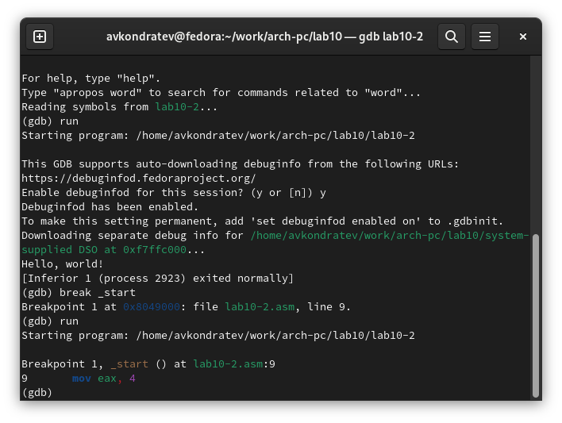{ #fig:003 width=70% }

4.	Посмотрел дисассимилированный код программы(рис.[-@fig:004])

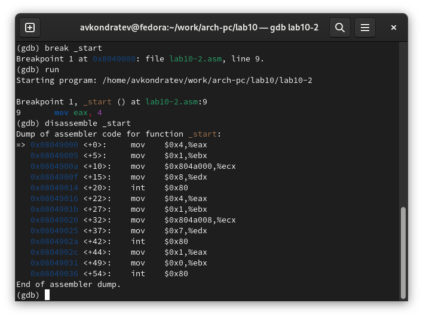{ #fig:004 width=70% }

5.	Переключился на отображение команд с Intel’овским синтаксисом(рис.[-@fig:005])

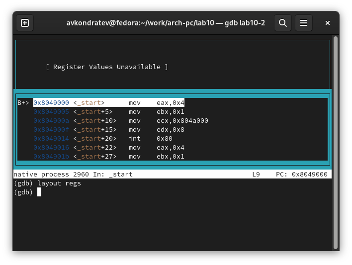{ #fig:005 width=70% }

6.	Посмотрел значение переменной msg2 по адресу и изменил значение ячейки памяти(рис.[-@fig:006])

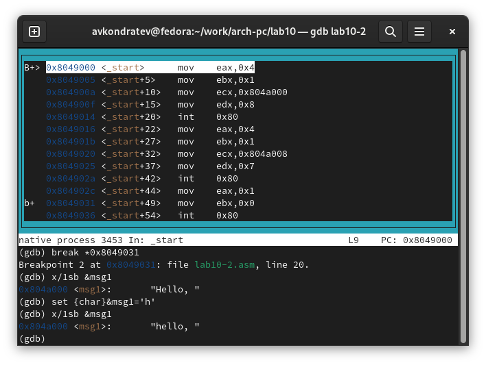{ #fig:006 width=70% }

7. Заменил символ во второй переменной msg2(рис.[-@fig:007])

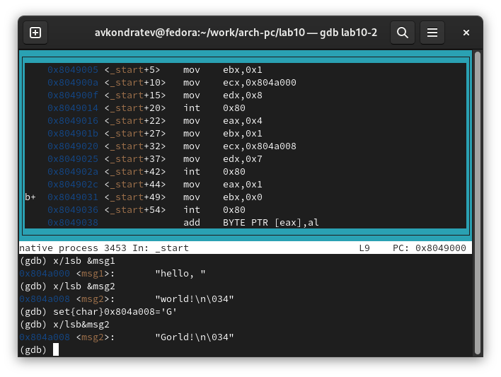{ #fig:007 width=70% }

8. Посмотрел количество аргументов командной строки(рис.[-@fig:008])

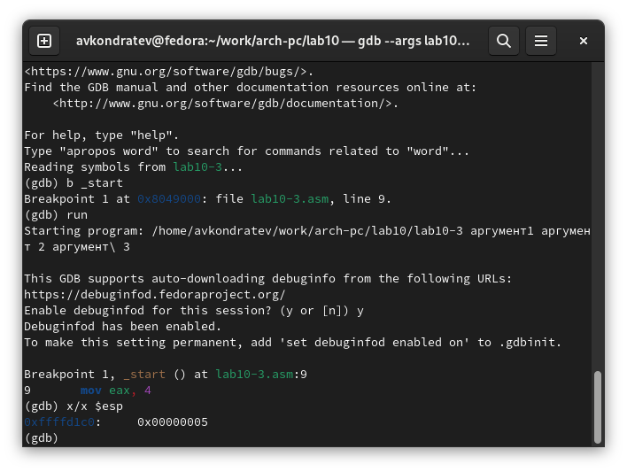{ #fig:008 width=70% }

9. Преобразовал программу из лабораторной работы №9, реализовав вычисление значения функции как подпрограмму(рис.[-@fig:009])(рис.[-@fig:010])

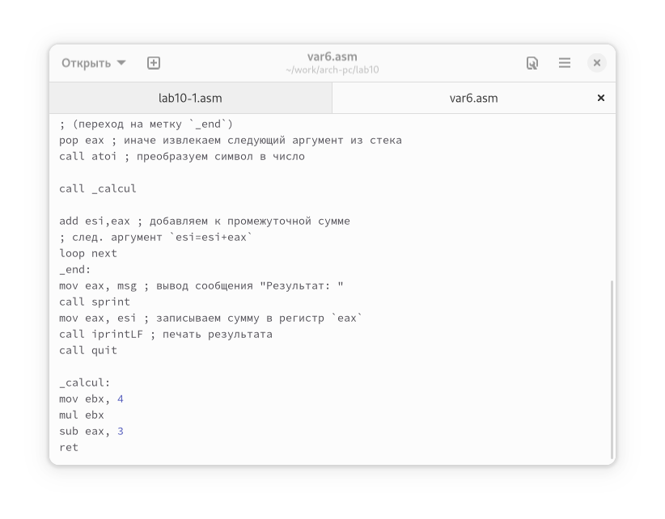{ #fig:009 width=70% }

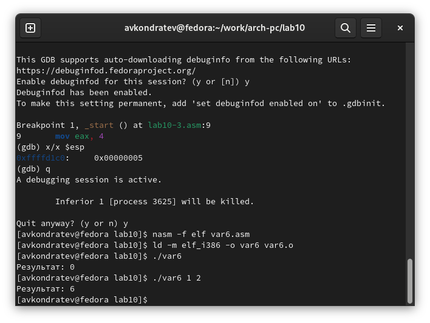{ #fig:010 width=70% }

10. С помощью отладчика GDB, анализируя изменения значений регистров, определил ошибку и исправил ее(рис.[-@fig:011])(рис.[-@fig:012])(рис.[-@fig:013])

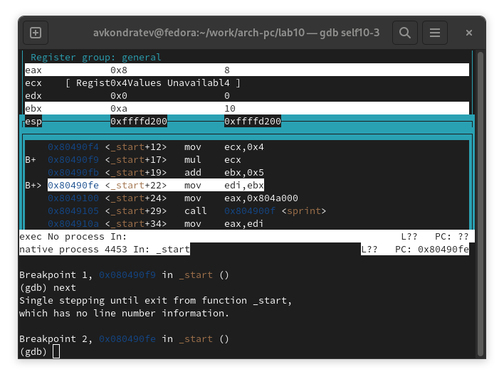{ #fig:011 width=70% }

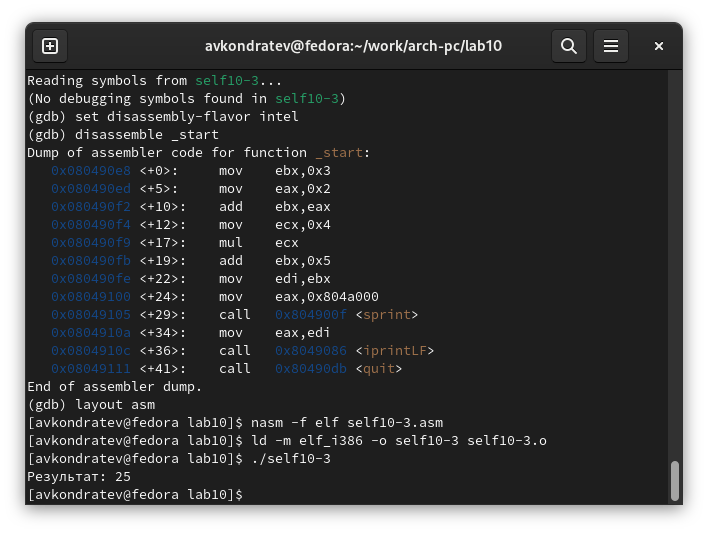{ #fig:012 width=70% }

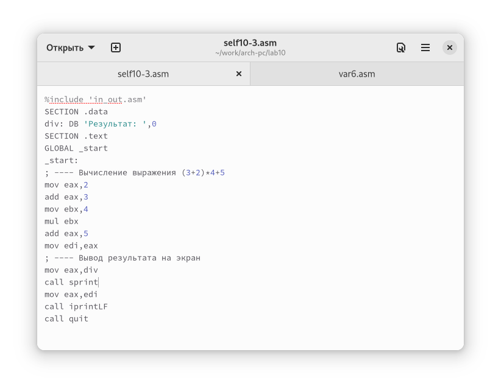{ #fig:013 width=70% }

# Выводы

Я приобрел навыки написания программ с использованием подпрограмм.
Познакомился с методами отладки при помощи GDB и его основными возможностями

# Контрольные вопросы

1. Инструкция call и инструкция ret

2. С помощью инструкции call и имени подпрограммы

3. Для вызова подпрограммы из основной программы используется инструкция
call, которая заносит адрес следующей инструкции в стек и загружает в регистр
eip адрес соответствующей подпрограммы. Подпрограмма завершается инструкцией ret, которая извлекает из стека
адрес, занесённый туда соответствующей инструкцией call, и заносит его в eip.

4. Операнд необязателен, но если он есть, то после того, как будет считан адрес возврата, из стека будет удалено столько байтов, сколько указано в операнде

5. Отладчики позволяют управлять ходом выполнения программы, контролировать и изменять данные. Это помогает быстрее найти место ошибки в программе
и ускорить её исправление

6. В отладке можно видеть текущие(во время останова) значения регистров, их адреса.
С помощью GDB run

7. breakpoint - это преднамеренное прерывание выполнения программы, при котором выполняется вызов отладчика    
сheckpoint - снимок состояния программы  
Watchpoint - точка останова по данным. Срабатывает, когда меняется значение заданного выражения или переменной  
Catchpoint - специальная точка останова, которая срабатывает при достижении специального события, например, C++ исключения или загрузки библиотеки  
Call stack (стек вызовов) - хранит информацию об активных процедурах и функциях  

8. disassemble - Посмотреть дизассемблированный код программы   
run - запуск в режиме отладки  
breakpoint - установить точку останова  
kill (сокращённо k) прекращает отладку программы  
next - переход к следующей точке останова

