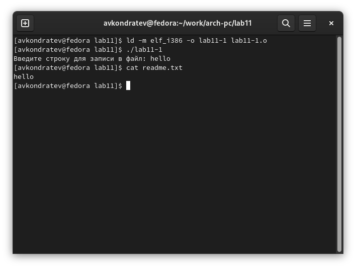
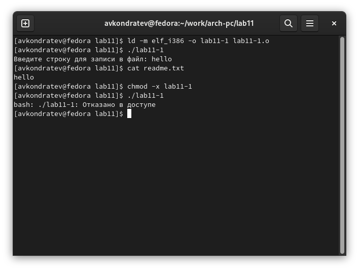
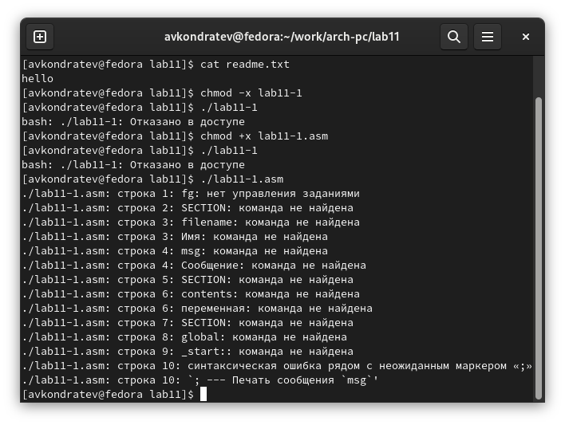
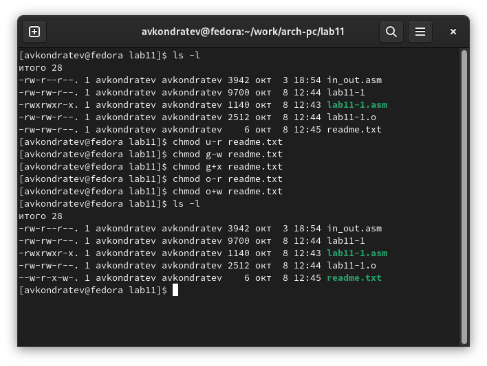
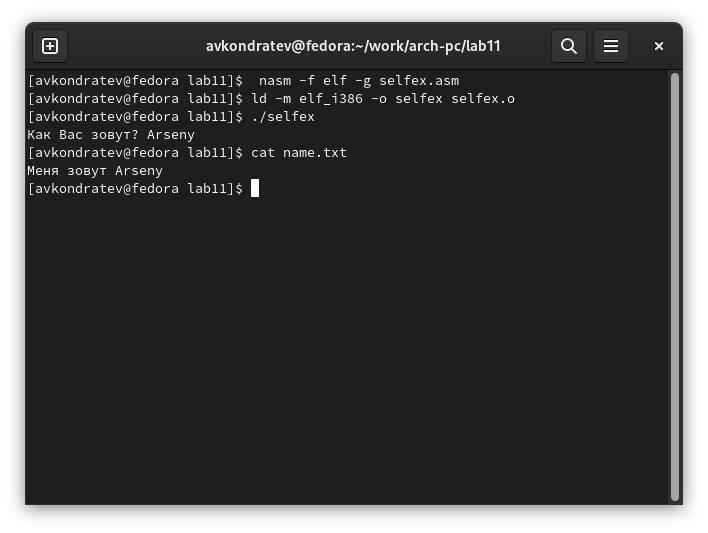

---
## Front matter
lang: ru-RU
title: "Лабораторная работа №11"
subtitle: "Дисциплина: Архитектура компьютера"
author: "Кондратьев Арсений Вячеславович"
institute: "Российский университет дружбы народов, Москва, Россия"
date: 08.10.2022

## Generic otions
lang: ru-RU
toc-title: "Содержание"

## Bibliography
bibliography: bib/cite.bib
csl: pandoc/csl/gost-r-7-0-5-2008-numeric.csl

## Pdf output format
toc: true # Table of contents
toc-depth: 2

fontsize: 12pt
linestretch: 1.5
papersize: a4
documentclass: scrreprt
## I18n polyglossia
polyglossia-lang:
  name: russian
  options:
	- spelling=modern
	- babelshorthands=true
polyglossia-otherlangs:
  name: english
## I18n babel
babel-lang: russian
babel-otherlangs: english
## Fonts
mainfont: PT Serif
romanfont: PT Serif
sansfont: PT Sans
monofont: PT Mono
mainfontoptions: Ligatures=TeX
romanfontoptions: Ligatures=TeX
sansfontoptions: Ligatures=TeX,Scale=MatchLowercase
monofontoptions: Scale=MatchLowercase,Scale=0.9
## Biblatex
biblatex: true
biblio-style: "gost-numeric"
biblatexoptions:
  - parentracker=true
  - backend=biber
  - hyperref=auto
  - language=auto
  - autolang=other*
  - citestyle=gost-numeric

## Misc options
indent: true
header-includes:
  - \usepackage{indentfirst}
  - \usepackage{float} # keep figures where there are in the text
  - \floatplacement{figure}{H} # keep figures where there are in the text
---

# Цель работы

Приобретение навыков написания программ для работы с файлами.

# Выполнение лабораторной работы

1. Ввел в файл lab11-1.asm текст программы из листинга 11.1(рис.[-@fig:001])

 { #fig:001 width=70% }
 
2. С помощью команды chmod изменил права доступа к исполняемому файлу
lab11-1, запретив его выполнение(рис.[-@fig:002])

{ #fig:002 width=70% }

Выдало ошибку отказано в доступе, тк я убрал права на выполнение

3.	С помощью команды chmod изменил права доступа к файлу lab11-1.asm с
исходным текстом программы,добавив права на исполнение (рис.[-@fig:003])

{ #fig:003 width=70% }

Каждую строчку программы терминал воспринимает как отдельную команду, поэтому
выдает ошибки

4.	Предоставил права доступа к файлу readme.txt в соответствии с 6 вариантом(рис.[-@fig:004])

{ #fig:004 width=70% }

5.	Напишите программу работающую по следующему алгоритму  
Вывод приглашения “Как Вас зовут?”  
ввести с клавиатуры свои фамилию и имя  
создать файл с именем name.txt  
записать в файл сообщение “Меня зовут”  
дописать в файл строку введенную с клавиатуры  
закрыть файл  
(рис.[-@fig:005])

{ #fig:005 width=70% }

# Выводы

Я приобрел навыки написания программ для работы с файлами.

# Контрольные вопросы

1. Права доступа определяют набор действий (чтение, запись, выполнение), разрешённых для выполнения пользователям системы над файлами. Для каждого
файла пользователь может входить в одну из трех групп: владелец, член группы
владельца, все остальные

2. по специальному флагу исполняемости x. С помощью команды chmod, r w

3. Для каждого файла пользователь может входить в одну из трех групп: владелец, член группы владельца, все остальные(u, g, o)

4. sys_read(3), sys_write(4), sys_open(5),
sys_close(6), sys_creat(8)

5. sys_read 3 eax    
дескриптор файла ebx   
адрес в памяти ecx  
количество байтов edx

sys_write 4 eax  
дескриптор файла ebx  
строка ecx  
количество байтов edx

sys_open 5 eax    
имя файла ebx  
режим доступа к файлу ecx  
права доступа к файлу edx  

sys_close 6 eax  
дескриптор файла ebx  

sys_creat 8 eax  
имя файла ebx  
права доступа к файлу ecx  

6. уникальный номер (16-битное целое число)

